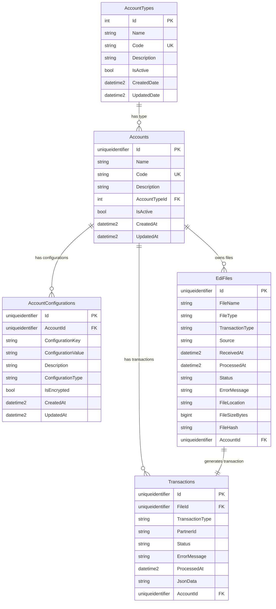

# EDI Processing Database Documentation

## Overview

The EDI Processing application uses a SQL Server database with a clean, normalized schema designed to handle Electronic Data Interchange (EDI) file processing, account management, and transaction tracking. The database is organized under the `edi` schema for better organization and security.

## Database Schema

### Database Information
- **Database Name**: `EDIProcessingDB_Dev` (Development) / `EDIProcessingDB` (Production)
- **Schema**: `edi`
- **Framework**: Entity Framework Core 8.0
- **Provider**: Microsoft SQL Server

## Entity Relationship Diagram



## Table Details

### 1. AccountTypes (`edi.AccountTypes`)

**Purpose**: Categorizes different types of trading partners in the EDI ecosystem.

| Column | Type | Constraints | Description |
|--------|------|-------------|-------------|
| Id | int | PK, Identity | Primary key |
| Name | nvarchar(50) | NOT NULL | Display name of account type |
| Code | nvarchar(10) | NOT NULL, Unique | Short code identifier |
| Description | nvarchar(500) | NULL | Detailed description |
| IsActive | bit | NOT NULL, Default: 1 | Active status flag |
| CreatedDate | datetime2 | NOT NULL, Default: GETUTCDATE() | Creation timestamp |
| UpdatedDate | datetime2 | NULL | Last update timestamp |

**Indexes**:
- `IX_AccountTypes_Code` (Unique)
- `IX_AccountTypes_Name`
- `IX_AccountTypes_IsActive`

**Seeded Data**:
```sql
-- 5 default account types are seeded
1. Customer (CUST) - Customer accounts that receive goods or services
2. Vendor (VEND) - Vendor/Supplier accounts that provide goods or services
3. Partner (PART) - Business partner accounts for collaborative transactions
4. Distributor (DIST) - Distributor accounts for product distribution networks
5. Logistics Provider (LOGIS) - Third-party logistics and shipping provider accounts
```

### 2. Accounts (`edi.Accounts`)

**Purpose**: Stores account information for trading partners, customers, vendors, etc.

| Column | Type | Constraints | Description |
|--------|------|-------------|-------------|
| Id | uniqueidentifier | PK | Primary key (GUID) |
| Name | nvarchar(100) | NOT NULL | Account display name |
| Code | nvarchar(50) | NOT NULL, Unique | Unique account identifier |
| Description | nvarchar(500) | NULL | Account description |
| AccountTypeId | int | FK, NOT NULL | Reference to AccountTypes |
| IsActive | bit | NOT NULL | Active status flag |
| CreatedAt | datetime2 | NOT NULL | Creation timestamp |
| UpdatedAt | datetime2 | NOT NULL | Last update timestamp |

**Indexes**:
- `IX_Accounts_Code` (Unique)
- `IX_Accounts_AccountTypeId`

**Relationships**:
- `FK_Accounts_AccountTypes_AccountTypeId` → AccountTypes.Id (NO ACTION)

### 3. AccountConfigurations (`edi.AccountConfigurations`)

**Purpose**: Stores key-value configuration pairs for each account, enabling flexible account-specific settings.

| Column | Type | Constraints | Description |
|--------|------|-------------|-------------|
| Id | uniqueidentifier | PK | Primary key (GUID) |
| AccountId | uniqueidentifier | FK, NOT NULL | Reference to Accounts |
| ConfigurationKey | nvarchar(100) | NOT NULL | Configuration setting name |
| ConfigurationValue | nvarchar(max) | NOT NULL | Configuration value |
| Description | nvarchar(500) | NULL | Configuration description |
| ConfigurationType | nvarchar(50) | NOT NULL, Default: 'General' | Category of configuration |
| IsEncrypted | bit | NOT NULL | Whether value is encrypted |
| CreatedAt | datetime2 | NOT NULL | Creation timestamp |
| UpdatedAt | datetime2 | NOT NULL | Last update timestamp |

**Indexes**:
- `IX_AccountConfigurations_AccountId_ConfigurationKey` (Unique composite)

**Relationships**:
- `FK_AccountConfigurations_Accounts_AccountId` → Accounts.Id (CASCADE)

**Configuration Types**:
- `General` - General settings
- `SFTP` - SFTP connection settings
- `EDI` - EDI-specific configurations
- `Security` - Security-related settings

### 4. EdiFiles (`edi.EdiFiles`)

**Purpose**: Tracks all EDI files uploaded or received via SFTP, storing metadata and processing status.

| Column | Type | Constraints | Description |
|--------|------|-------------|-------------|
| Id | uniqueidentifier | PK | Primary key (GUID) |
| FileName | nvarchar(255) | NOT NULL | Original file name |
| FileType | nvarchar(50) | NOT NULL | File type/format |
| TransactionType | nvarchar(50) | NOT NULL | EDI transaction type (850, 855, etc.) |
| Source | nvarchar(50) | NOT NULL | Source of file (API, SFTP) |
| ReceivedAt | datetime2 | NOT NULL | When file was received |
| ProcessedAt | datetime2 | NULL | When file was processed |
| Status | nvarchar(50) | NOT NULL, Default: 'Pending' | Processing status |
| ErrorMessage | nvarchar(max) | NULL | Error details if processing failed |
| FileLocation | nvarchar(255) | NOT NULL | Azure Blob Storage location |
| FileSizeBytes | bigint | NOT NULL | File size in bytes |
| FileHash | nvarchar(max) | NULL | File hash for integrity |
| AccountId | uniqueidentifier | FK, NULL | Associated account |

**Indexes**:
- `IX_EdiFiles_FileName`
- `IX_EdiFiles_ReceivedAt`
- `IX_EdiFiles_Status`
- `IX_EdiFiles_AccountId`

**Relationships**:
- `FK_EdiFiles_Accounts_AccountId` → Accounts.Id (SET NULL)

**Status Values**:
- `Pending` - File received, awaiting processing
- `Processing` - Currently being processed
- `Completed` - Successfully processed
- `Failed` - Processing failed
- `Archived` - Archived after successful processing

### 5. Transactions (`edi.Transactions`)

**Purpose**: Stores parsed EDI transaction data and processing results. **Automatically created** for every file upload/SFTP receipt.

| Column | Type | Constraints | Description |
|--------|------|-------------|-------------|
| Id | uniqueidentifier | PK | Primary key (GUID) |
| FileId | uniqueidentifier | FK, NOT NULL | Reference to source EdiFile |
| TransactionType | nvarchar(50) | NOT NULL | EDI transaction type |
| PartnerId | nvarchar(100) | NOT NULL | Trading partner identifier |
| Status | nvarchar(50) | NOT NULL, Default: 'Pending' | Transaction status |
| ErrorMessage | nvarchar(max) | NULL | Processing error details |
| ProcessedAt | datetime2 | NOT NULL | Processing timestamp |
| JsonData | nvarchar(max) | NOT NULL | Parsed transaction data as JSON |
| AccountId | uniqueidentifier | FK, NULL | Associated account |

**Indexes**:
- `IX_Transactions_FileId`
- `IX_Transactions_PartnerId`
- `IX_Transactions_ProcessedAt`
- `IX_Transactions_Status`
- `IX_Transactions_AccountId`

**Relationships**:
- `FK_Transactions_EdiFiles_FileId` → EdiFiles.Id (CASCADE)
- `FK_Transactions_Accounts_AccountId` → Accounts.Id (SET NULL)

**Status Values**:
- `Pending` - Transaction created, awaiting processing
- `Processing` - Currently being processed
- `Completed` - Successfully processed
- `Failed` - Processing failed
- `Acknowledged` - Acknowledgment sent

## Key Features

### 1. Automatic Transaction Creation
- **Every file upload** (via API) automatically creates a transaction record
- **Every SFTP file receipt** automatically creates a transaction record
- Initial transaction created with default values (TransactionType: "850")
- Later updated during actual file parsing with real data

### 2. Account Type Management
- Pre-seeded with 5 common EDI account types
- Extensible for custom account types
- Supports categorization of trading partners

### 3. Flexible Configuration System
- Key-value pairs per account
- Support for encrypted values
- Categorized configuration types
- Unique constraints prevent duplicate keys per account

### 4. File Tracking & Auditing
- Complete file processing history
- Status tracking from receipt to completion
- Error logging and debugging support
- File integrity verification with hashing

### 5. Data Integrity
- Foreign key relationships with appropriate cascade rules
- Unique constraints on business keys
- Indexed for performance
- Proper null handling for optional relationships

## Usage Patterns

### File Processing Workflow
1. **File Receipt**: File uploaded via API or received via SFTP
2. **EdiFile Record**: Created with metadata and status "Pending"
3. **Transaction Creation**: Automatically created with default values
4. **File Validation**: File structure and format validation
5. **Parsing**: EDI content parsed and transaction updated with actual data
6. **Status Updates**: Both EdiFile and Transaction status updated throughout process
7. **Completion**: Final status set, acknowledgments sent if required

### Account Configuration Examples
```sql
-- SFTP Configuration for an account
INSERT INTO edi.AccountConfigurations VALUES
('guid', 'account-id', 'SftpHost', 'sftp.partner.com', 'SFTP server hostname', 'SFTP', 0),
('guid', 'account-id', 'SftpUsername', 'ediuser', 'SFTP username', 'SFTP', 0),
('guid', 'account-id', 'SftpPassword', 'encrypted-password', 'SFTP password', 'SFTP', 1);

-- EDI Configuration
INSERT INTO edi.AccountConfigurations VALUES
('guid', 'account-id', 'PreferredTransactionTypes', '850,855,856', 'Supported transaction types', 'EDI', 0);
```

## Performance Considerations

### Indexing Strategy
- **Primary Keys**: Clustered indexes on all primary keys
- **Foreign Keys**: Indexes on all foreign key columns
- **Business Keys**: Unique indexes on business identifiers (codes)
- **Query Patterns**: Indexes on commonly queried columns (status, dates)

### Partitioning Recommendations (Future)
For high-volume environments, consider partitioning:
- `EdiFiles` by `ReceivedAt` (monthly partitions)
- `Transactions` by `ProcessedAt` (monthly partitions)

### Archival Strategy
- Archive completed transactions older than configured retention period
- Move old files to cold storage while keeping metadata
- Implement soft deletes for audit trail preservation

## Migration and Deployment

### Entity Framework Migrations
Current migration: `20250811203035_InitialCreate`

```bash
# Create new migration
dotnet ef migrations add MigrationName --startup-project ..\EDIProcessingApp.API

# Update database
dotnet ef database update --startup-project ..\EDIProcessingApp.API

# Reset database (development only)
dotnet ef database drop --startup-project ..\EDIProcessingApp.API --force
dotnet ef database update --startup-project ..\EDIProcessingApp.API
```

### Data Seeding
The application automatically seeds:
- 5 AccountTypes with standard EDI partner types
- 3 sample Accounts (one of each: Customer, Vendor, Partner)
- Sample AccountConfigurations for each account

## Security Considerations

### Data Protection
- Sensitive configuration values encrypted using `IsEncrypted` flag
- Connection strings secured in Azure Key Vault (production)
- SQL Server authentication with strong passwords
- Network isolation with Azure Virtual Networks

### Access Control
- Database schema (`edi`) provides namespace isolation
- Application uses dedicated database user with minimal permissions
- No direct database access from external systems
- All access through application APIs with authentication

### Audit Trail
- All tables include creation and update timestamps
- Soft deletes preserve data for audit purposes
- File hashes ensure data integrity
- Complete processing history maintained

## Backup and Recovery

### Backup Strategy
- Daily full backups
- Transaction log backups every 15 minutes
- Cross-region backup replication for disaster recovery

### Recovery Procedures
- Point-in-time recovery capability
- Automated backup testing
- Documented recovery procedures
- Regular disaster recovery drills

## Monitoring and Maintenance

### Health Checks
- Database connectivity monitoring
- Table space utilization alerts
- Performance metric tracking
- Failed transaction monitoring

### Maintenance Tasks
- Index rebuilding (weekly)
- Statistics updates (daily)
- Backup verification (daily)
- Archive old data (monthly)

## Connection Strings

### Development
```json
{
  "ConnectionStrings": {
    "DefaultConnection": "Server=.;Database=EDIProcessingDB_Dev;Trusted_Connection=true;MultipleActiveResultSets=true;TrustServerCertificate=true;"
  }
}
```

### Production (Azure SQL)
```json
{
  "ConnectionStrings": {
    "DefaultConnection": "Server=sql-edi-processing.database.windows.net;Database=EDIProcessingDB;User Id=ediadmin;Password=YourSecurePassword123!;Encrypt=True;"
  }
}
```

---

## Quick Reference

### Common Queries

```sql
-- Get account types with counts
SELECT at.Name, at.Code, COUNT(a.Id) as AccountCount
FROM edi.AccountTypes at
LEFT JOIN edi.Accounts a ON at.Id = a.AccountTypeId
GROUP BY at.Id, at.Name, at.Code;

-- Get recent files by status
SELECT FileName, Status, ReceivedAt, ProcessedAt
FROM edi.EdiFiles
WHERE ReceivedAt >= DATEADD(day, -7, GETDATE())
ORDER BY ReceivedAt DESC;

-- Get account configurations
SELECT a.Name, ac.ConfigurationKey, ac.ConfigurationValue, ac.ConfigurationType
FROM edi.Accounts a
JOIN edi.AccountConfigurations ac ON a.Id = ac.AccountId
WHERE a.Code = 'ACME001';

-- Get transaction processing summary
SELECT 
    TransactionType,
    Status,
    COUNT(*) as Count,
    AVG(DATEDIFF(second, ef.ReceivedAt, t.ProcessedAt)) as AvgProcessingSeconds
FROM edi.Transactions t
JOIN edi.EdiFiles ef ON t.FileId = ef.Id
WHERE t.ProcessedAt >= DATEADD(day, -30, GETDATE())
GROUP BY TransactionType, Status;
```
